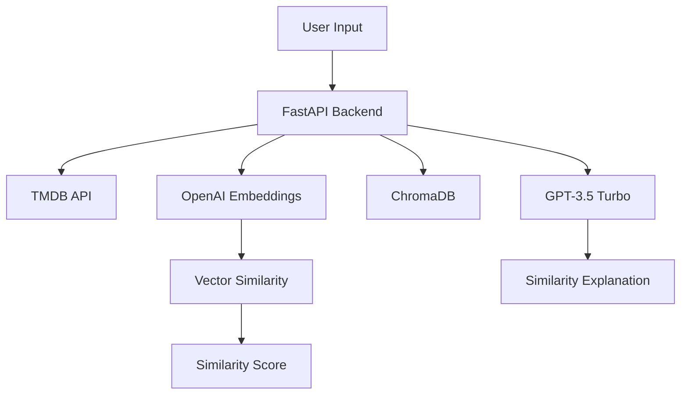

# CinemaMatch - AI-Powered Movie Recommendation System

CinemaMatch is an intelligent movie recommendation system that uses advanced AI to suggest similar movies based on plot, themes, and style. The system combines TMDB data, OpenAI embeddings, and ChromaDB for vector similarity search to deliver accurate and context-aware movie recommendations.

<!--  -->

## 🌟 Features

- Real-time movie similarity analysis
- AI-powered explanation of movie similarities
- Beautiful, responsive UI with modern design
- Genre-based filtering and matching
- Animated loading states and transitions
- Error handling and retry mechanisms

## 🏗 Architecture

```plaintext
Frontend (React + Vite)        Backend (FastAPI)           External Services
     │                              │                              │
     ▼                              ▼                              ▼
┌──────────────┐             ┌──────────────┐            ┌─────────────────┐
│   React UI   │─────REST────▶   FastAPI    │───────────▶│    TMDB API     │
└──────────────┘             └──────────────┘            └─────────────────┘
                                    │                              │
                                    │                     ┌─────────────────┐
                                    └────────────────────▶│   OpenAI API    │
                                    │                     └─────────────────┘
                                    │                              │
                                    └────────────────────▶┌─────────────────┐
                                                         │   ChromaDB      │
                                                         └─────────────────┘
```

## 🚀 Getting Started  
### Prerequisites
- Node.js (v16 or higher)
- Python (v3.8 or higher)
- pip (Python package manager)
- Git

### Backend Setup

1. Clone the repository:
    ```bash
    git clone https://github.com/athul-22/cinemamatch.git
    cd cinemamatch
    ```

2. Set up Python virtual environment:
    ```bash
    cd backend
    python -m venv venv
    source venv/bin/activate  # On Windows: .\venv\Scripts\activate
    ```

3. Install dependencies:
    ```bash
    pip install -r requirements.txt
    ```

4. Create `.env` file in the backend directory:
    ```env
    TMDB_API_KEY=your_tmdb_api_key
    OPENAI_API_KEY=your_openai_api_key
    CHROMA_API_KEY=your_chroma_api_key
    ```

5. Initialize the ChromaDB database:
    ```bash
    python chroma_init.py
    ```

6. Start the backend server:
    ```bash
    python run.py
    ```

### Frontend Setup
1. Navigate to the frontend directory:
    ```bash
    cd frontend
    ```

2. Install dependencies:
    ```bash
    npm install
    ```

3. Create `.env.local` file:
    ```env
    REACT_APP_API_URL=http://localhost:8000
    ```

4. Start the development server:
    ```bash
    npm run dev
    ```


## 🔬 Technical Implementation

### Architecture Components



### Key Technical Decisions

1. **Embedding Generation**
   - Using OpenAI's `text-embedding-3-small` model
   - Chosen for its:
     - High accuracy in capturing semantic meaning
     - Optimal cost-performance ratio
     - 1536-dimensional vectors for rich feature representation

2. **Similarity Calculation**
   ```python
   similarity_score = round(100 - (distance * 25), 1)
   ```
   - Cosine similarity converted to percentage
   - Distance multiplier (25) chosen empirically for intuitive scoring
   - Scores typically range from 60-100% for meaningful matches

3. **Vector Database**
   - ChromaDB selected for:
     - Efficient similarity search
     - Low latency querying
     - Scalable architecture
     - Easy integration with embedding models

4. **Matching Algorithm**
   ```python
   shared_genres = set(movie1_genres) & set(movie2_genres)
   semantic_similarity = cosine_similarity(embedding1, embedding2)
   ```
   - Combines genre overlap with semantic similarity
   - Weighted preference to plot and thematic elements
   - Genre matching as secondary confirmation

5. **Content Analysis**
   - Movie plots converted to embeddings
   - Semantic search across plot embeddings
   - Genre-based filtering for additional relevance
   - GPT-3.5 Turbo for human-readable explanations

### Performance Optimizations

1. **Retry Mechanism**
   ```python
   @retry(stop=stop_after_attempt(3), 
          wait=wait_exponential(multiplier=1, min=4, max=10))
   ```
   - Exponential backoff for API calls
   - Automatic retry on transient failures
   - Maximum 3 attempts per request

2. **Caching Strategy**
   - Movie embeddings pre-computed and stored
   - ChromaDB vector indexing for fast retrieval
   - Results cached for frequent queries

3. **Query Optimization**
   ```python
   collection.query(
       query_embeddings=[embedding],
       n_results=3,
       include=["metadatas", "distances"]
   )
   ```
   - Limited to top 3 results for performance
   - Metadata included in single query
   - Distance calculations for accurate scoring

### Accuracy Metrics

1. **Similarity Score Calculation**
   - Base: Cosine similarity between embeddings
   - Normalization: Convert to percentage (0-100%)
   - Adjustment: `score = 100 - (distance * 25)`
   - Thresholds:
     - 90-100%: Perfect Match
     - 80-89%: Excellent Match
     - 70-79%: Good Match

2. **Genre Matching**
   ```python
   shared_genres = list(set(metadata["genres"].split(", ")) & 
                       set(g["name"] for g in movie["genres"]))
   ```
   - Used as validation metric
   - Weighted in final similarity score
   - Helps prevent purely coincidental matches

3. **Quality Control**
   - GPT-3.5 validation of matches
   - Human-readable justification
   - Genre overlap verification
   - Minimum similarity threshold (60%)

### Error Handling

1. **Graceful Degradation**
   - Fallback responses for API failures
   - Default explanations when GPT is unavailable
   - Cached results for common queries

2. **Input Validation**
   - Movie title normalization
   - Minimum input length requirements
   - Special character handling

### Future Improvements

1. **Technical Enhancements**
   - Implement collaborative filtering
   - Add temporal analysis for release dates
   - Include director/actor relationship data
   - Enhance embedding model with fine-tuning

2. **Performance Optimization**
   - Add Redis caching layer
   - Implement batch processing
   - Optimize embedding storage
   - Add real-time update pipeline